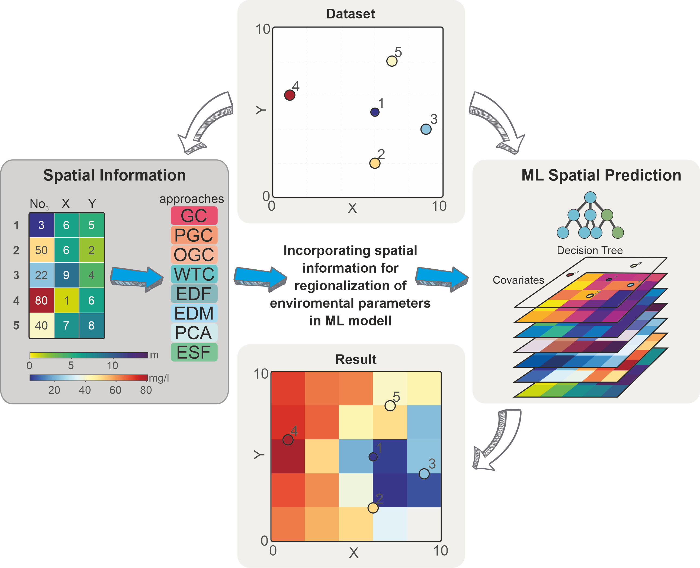

 

DOI of this repository:  

# Incorporating spatial information for regionalization of environmental parameters in machine learning models
This repository enables you to perform the calculations shown in the manuscript: "Comin soon"

Contact: marc.ohmer@kit.edu

ORCIDs of authors:  
M. Ohmer: [0000-0002-2322-335X](https://orcid.org/0000-0002-2322-335X)  
F. Doll: [0009-0003-5455-7162](https://orcid.org/0009-0003-5455-7162)  
T. Liesch: [0000-0001-8648-5333](https://orcid.org/0000-0001-8648-5333)  

For a detailed description please refer to the publication. Please adapt all absolute loading/saving and software paths within the scripts to make them running, you need Python software for a successful application.

